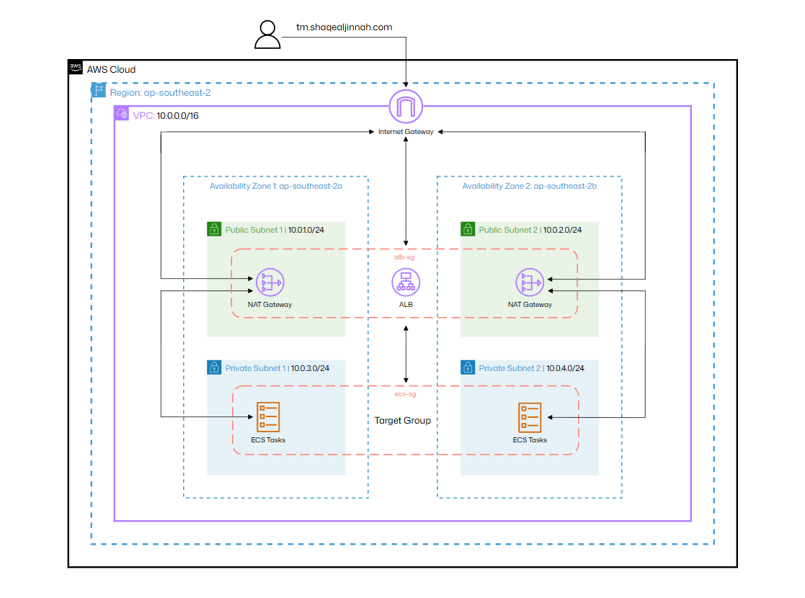
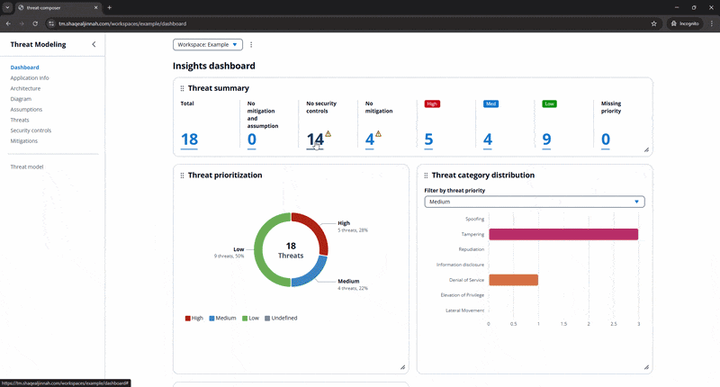

# ECS Threat Composer Deployment

Production deployment of AWS Labs Threat Composer App using Docker, Terraform and AWS.

**Live Application**: https://awslabs.github.io/threat-composer

## Overview

This project deploys a Threat Composer App (an open-source threat modeling ecosystem managed by AWS Labs) using:

- **Cloud:** AWS (VPC, subnets, compute, ecs)
- **Infrastructure as Code:** Terraform
- **Containerisation:** Docker
- **CI/CD:** GitHub Actions (soon to be added)

## Architecture



### Key Components

**Network:**
- VPC (10.0.0.0/16) across 2 availability zones
- Internet Gateway and NAT Gateway
- 2 Public subnets for ALB

**Security:**
- Security groups (ALB -> ECS)
- IAM roles with least privilege
- ECS Tasks in private subnets

**Compute:**
- ECS cluster with 2 tasks
- Docker image stored in ECR
- Serverless compute with Fargate


## Project Structure

```
threat-composer-app/
├── app/
│   ├── Dockerfile
|   ├── nginx/
|   └── ...
├── infra/
|   ├── backend.tf
|   ├── main.tf
|   ├── providers.tf
|   ├── terraform.tfvars
|   ├── variables.tf
|   └── modules
|       ├── acm/
|       ├── alb/
|       ├── ecr/
|       ├── ecs/
|       ├── iam/
|       ├── networking/
|       └── security/
|
├── images/
└── README.md
```

## Live Site

