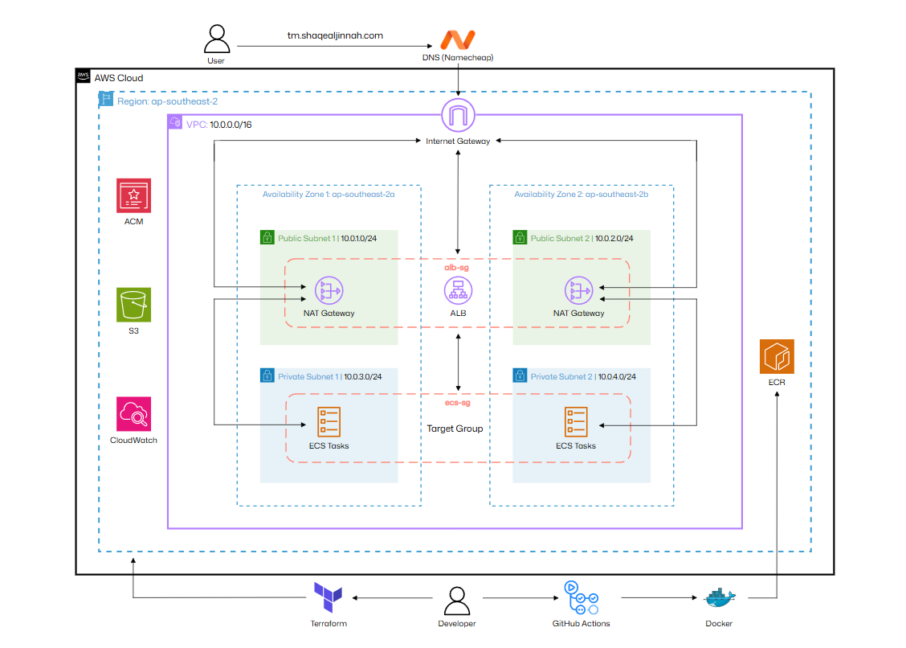

# ECS Threat Composer Deployment
<!-- Project badges -->


Production deployment of AWS Labs Threat Composer App using AWS, Terraform, Docker and GitHub Actions CI/CD.

**Live Application**: https://awslabs.github.io/threat-composer

## Overview

This project deploys a Threat Composer App (an open-source threat modeling ecosystem managed by AWS Labs) using:

- **Containerisation:** Multi-stage Docker builds
- **Infrastructure:** Terraform with modular architecture
- **Orchestration:** ECS Fargate (serverless compute)
- **Load Balancing:** Application Load Balancer with HTTPS
- **CI/CD:** GitHub Actions with automated deployments
- **Security:** Private subnets, security groups, OIDC and IAM

## Architecture



### High Level Flow

```
User searches our domain (tm.shaqealjinnah.com)
                        ↓
External DNS (Namecheap) routes to ALB via HTTPS
                        ↓
ALB forwards request to ECS Fargate Tasks (private subnet)
                        ↓            
ECS Tasks return stateful response of application code
```

### Key Components

**Network:**
- VPC (10.0.0.0/16) across 2 availability zones
- Internet Gateway and NAT Gateway
- 2 Public subnets for ALB
- 2 Private subnets for ECS tasks

**Security:**
- Security groups (ALB → ECS)
- IAM roles with least privilege
- ACM certificate for HTTPS
- OIDC Authentication

**Compute:**
- ECS cluster with 2 tasks
- Docker image stored in ECR
- Serverless compute with Fargate

## Tech Stack

- **Frontend:** ReactJs
- **Containerisation:** Docker
- **Web Server:** NGINX
- **Cloud:** AWS (ECS, ALB, ECR, VPC, ACM, IAM)
- **Infrastructure as Code:** Terraform
- **CI/CD:** GitHub Actions
- **Security:** Grype, ACM, OIDC

## CI/CD Pipeline

```
PR is merged to main
  │
  ├─► Build Pipeline runs
  │     ├── Build Docker image
  │     ├── Tag with commit SHA
  │     ├── Grype scan
  │     ├── OIDC auth to AWS
  │     └── Push to ECR
  │
  ├─► Deploy Pipeline triggers (after build succeeds)
  │     ├── OIDC auth to AWS
  │     ├── Fetch current task definition
  │     ├── Update image to new SHA
  │     ├── Register new task definition revision
  │     ├── Update ECS service
  │     └── Wait for stability
  │
  ▼
New version is live
```

## Project Structure

```
threat-composer-app/
├── app/
│   ├── Dockerfile
|   ├── nginx/
|   └── ...
|
├── infra/
|   ├── backend.tf
|   ├── main.tf
|   ├── providers.tf
|   ├── terraform.tfvars
|   ├── variables.tf
|   └── modules
|       ├── acm/
|       ├── alb/
|       ├── ecs/
|       ├── iam/
|       ├── networking/
|       └── security/
| 
├── bootstrap/
|   ├── chicken-egg
|   └── oidc
|
├── .github/workflows
|   ├── build.yml
|   ├── deploy.yml
|   └── reusable-ecs-deploy.yml
|
├── images/
└── README.md
```

## How to Reproduce

### Requirements
- AWS account
- Terraform v1+
- Node v20+
- Docker Desktop
- Domain managed by DNS

### 1. Local Setup

#### Clone app and install dependencies

```
git clone https://github.com/shaqealjinnah/threat-composer-app.git
cd app

yarn install
yarn build
yarn global add serve
serve -s build

#yarn start
http://localhost:3000/workspaces/default/dashboard

## or
yarn global add serve
serve -s build
```
### 2. Containerisation

#### Create docker image and run containers on port 8080

```
docker build -t <image_name> .
docker run -p 8080:8080 <image_name>
```

### 3. Image Registry

#### Push docker image to Amazon ECR

```
aws ecr get-login-password --region <region> \
| docker login --username AWS --password-stdin \
<aws_account_id>.dkr.ecr.<region>.amazonaws.com

docker tag <IMAGE-NAME:latest> \
<aws_account_id>.dkr.ecr.<region>.amazonaws.com/<repository:tag>

docker push \
<aws_account_id>.dkr.ecr.<region>.amazonaws.com/<repository:tag>
```

### 4. Configure Variables

#### Update tfvars file with your variables

```
cp terraform.example-tfvars terraform.tfvars
vim terraform.tfvars
```

### 5. Initiate Bootstrap

```
cd ~/threat-composer-app/chicken-egg

terraform init
terraform plan
terraform apply
```

### 6. Deploy Infrastructure

```
cd ~/threat-composer-app/infra

terraform init
terraform plan
terraform apply
```

### 7. CI/CD Automation

#### Add GitHub Action secrets

```
AWS_REGION=<your-region>

ECR_REPOSITORY=<ecr-repository-url> # Check ~/threat-composer/bootstrap/chicken-egg/outputs.tf

AWS_ROLE_ARN=<role-arn>             # Check ~/threat-composer/bootstrap/oidc/outputs.tf
```

## Live Site


## Future Improvement
- Blue/Green ECS deployments
- WAF integration
- ECS auto-scaling
- CloudFront for CDN